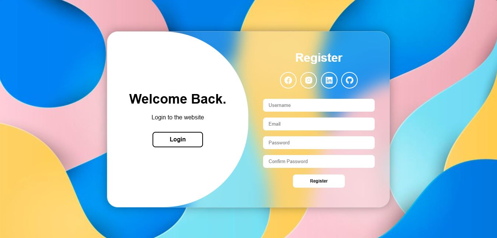

# 📝 Formulário de Login e Registro Animado Moderno

Este é um projeto de **Formulário de Login e Registro Animado Moderno** desenvolvido com **HTML**, **CSS** e **JavaScript**. O objetivo deste projeto é criar uma interface de usuário elegante, com animações suaves, para a autenticação de usuários.

---

## 🚀 Funcionalidades

- **Animações Suaves**: Transições animadas entre as telas de login e registro.
- **Troca Dinâmica**: Alternância fácil entre os formulários de Login e Registro.
  
---

## 🛠️ Tecnologias Utilizadas

- **HTML5**: Para a estrutura do formulário.
- **CSS3**: Para o design visual e animações.
- **JavaScript (ES6)**: Para a alternância dinâmica entre login e registro, e validações simples.

---

## 📥 Instalação

Para rodar este projeto localmente, siga os passos abaixo:

1. **Clone o repositório**:
   ```bash
   git clone https://github.com/seu-usuario/formulario-login-registro.git

---

